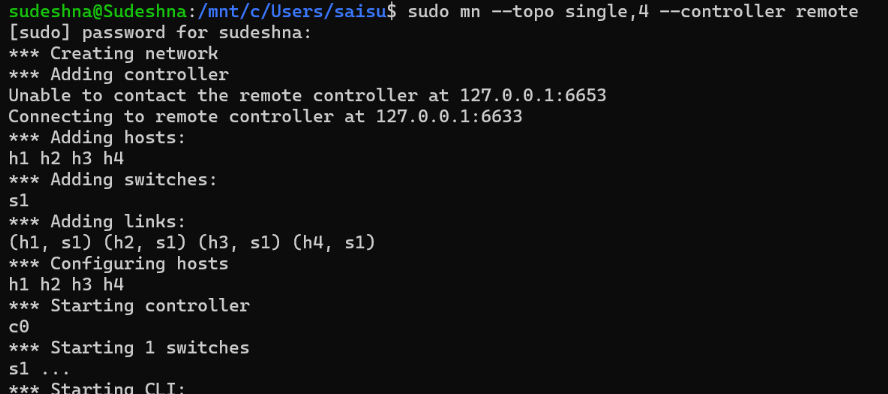
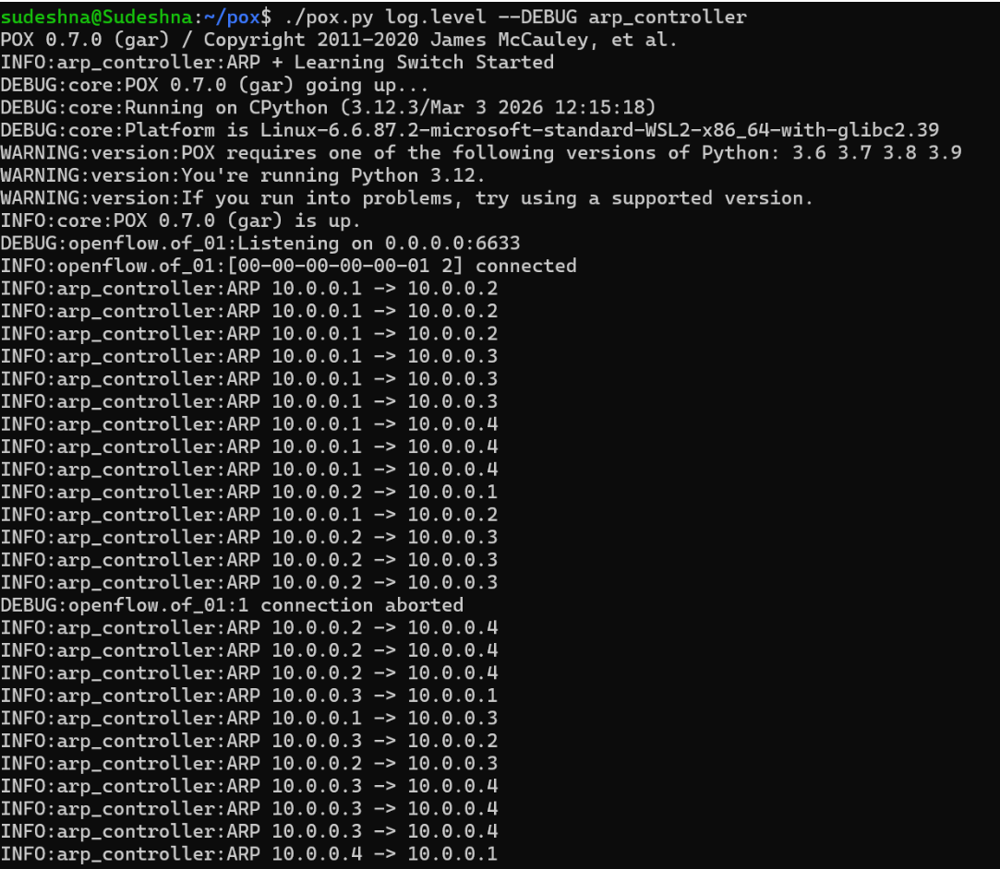
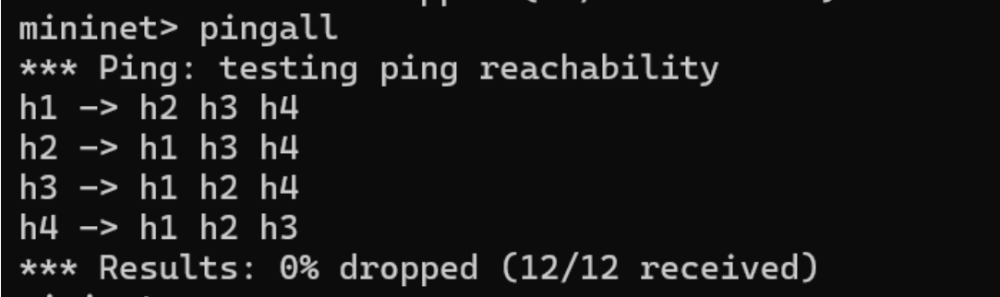

# SDN - ARP Handling

**NAME:** N. Sai Sudeshna  
**SRN:** PES2UG24CS313  
**SECTION:** F  

---

## 📄 Abstract

This project focuses on implementing Address Resolution Protocol (ARP) handling in a Software Defined Networking (SDN) environment using a POX controller and Mininet emulator. In traditional networks, ARP requests are broadcast to all devices, leading to unnecessary network traffic and inefficiencies. To address this, the proposed system leverages the centralized control of SDN to optimize ARP processing.

The controller intercepts ARP packets sent by hosts and maintains an IP-to-MAC mapping table. When an ARP request is received, the controller checks its table and directly generates an ARP reply if the destination information is available, thereby reducing broadcast overhead. Additionally, the system implements a learning switch mechanism.

---

## 🔗 GitHub Repository Link

https://github.com/Sudeshna-2006/SDN_ARP_POX

---

## 🏗️ Topology

- 1 Switch (s1)
- 4 Hosts (h1, h2, h3, h4)
- 1 POX Controller

---

## ⚙️ Setup & Execution

### Step 1: Clean Mininet
```bash
sudo mn -c
```

### Step 2: Run POX Controller
```bash
cd ~/pox
./pox.py log.level --DEBUG arp_controller
```

### Step 3: Run Mininet
```bash
sudo mn --topo single,4 --controller remote
```

---

## 🧪 Testing

```bash
pingall
```


```bash
sudo ovs-ofctl dump-flows s1
```

---

## 📸 Screenshots

### 1️⃣ Topology


---

### 2️⃣ ARP Controller Running


---

### 3️⃣ Flow Rules


---

### 4️⃣ Pingall Output (0% Drop)


---

## 🔄 Flow of Execution

1. Host sends packet  
2. Switch receives packet  
3. Switch sends PacketIn to controller  
4. Controller processes packet  
   - If ARP → reply  
   - Else → forward or flood  
5. Switch forwards packet  

---

## 🔍 Observations

- ARP handled by controller  
- Reduced broadcast traffic  
- Learning switch improves efficiency  
- Successful communication (0% drop)

---

## 📌 Conclusion

This project demonstrates efficient ARP handling using SDN, reducing broadcast traffic and improving network performance.

---

## 👩‍💻 Author

N. Sai Sudeshna
